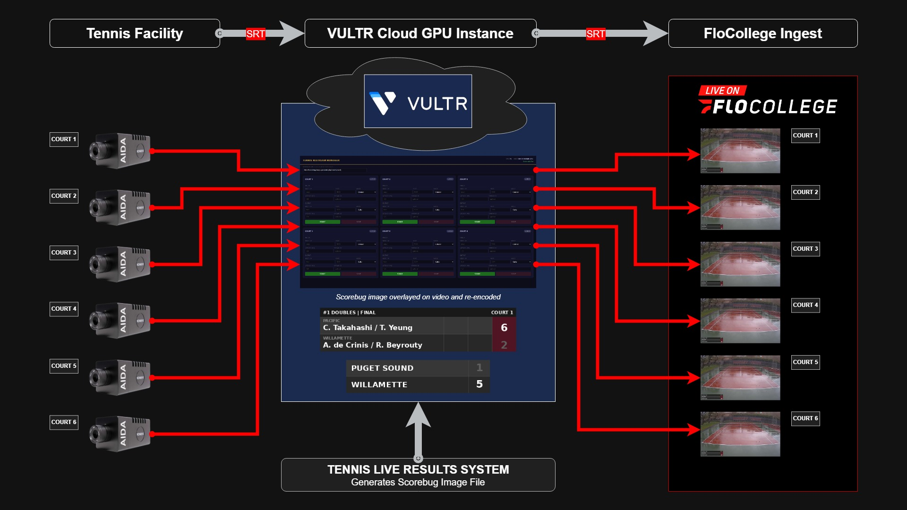

# Tennis SRT Scorebug Gateway



Manages up to 6 simultaneous SRT video restreams for live tennis tournament broadcasts. Each stream receives an SRT feed from a court camera, overlays a live scorebug, and outputs an SRT stream to a production switcher (e.g. vMix).

## What it does

- Receives SRT video from 6 court cameras (ports 5001–5006, listener or caller mode)
- Fetches live scorebug images (JPEG) from a web endpoint every second
- Overlays the scorebug onto the video using FFmpeg + NVIDIA NVENC hardware encoding
- Outputs SRT streams (ports 6001–6006, listener or caller mode)
- Optionally overlays a team scorebug (top-left corner, same URL for all courts)
- Web UI for starting/stopping streams, configuring SRT settings, and monitoring status
- Per-court FFmpeg log panel for real-time diagnostics

## Architecture

```
Camera (SRT caller) → [port 5001-5006]
                              ↓
                       FFmpeg (NVENC)
                              ↓
                    Scorebug overlay (MJPEG via FIFO)
                              ↓
                      [port 6001-6006] → vMix (SRT caller)
```

- **Backend:** Node.js + Express + WebSocket (`server.js`)
- **Stream management:** `src/stream-manager.js` — one instance per court
- **Scorebug rendering:** PHP endpoint fetched every 1s, written to a named FIFO pipe
- **Encoding:** `h264_nvenc -preset p1 -tune ull -b:v 8000k -maxrate 8000k -bufsize 16000k -g 60`
- **UI:** `public/` — vanilla JS, no framework

## Requirements

- Ubuntu with NVIDIA GPU (NVENC)
- Node.js 22+
- FFmpeg with NVENC support
- nginx (for HTTPS reverse proxy)

## Deployment

### First-time setup

The Vultr startup script handles everything. It should contain:

```sh
#!/bin/sh

# TLS certificate (Let's Encrypt, expires 2026-06-12)
cat > /etc/ssl/tennis.crt << 'EOF'
...fullchain.pem...
EOF

cat > /etc/ssl/tennis.key << 'EOF'
...privkey.pem...
EOF

chmod 600 /etc/ssl/tennis.key

# Configuration — URLs and webhook (kept out of the public repo)
cat > /etc/tennis-env << 'EOF'
DOMAIN=your-domain.com
EMAIL=your@email.com
BASIC_AUTH_USER=admin
BASIC_AUTH_PASS=your-password
SCOREBUG_URL=https://your-domain/scorebug.php?court={court}
TEAM_BUG_URL=https://your-domain/scorebug-team.php
MSG_WEBHOOK_URL=https://chat.googleapis.com/v1/spaces/.../messages?key=...
EOF

# Run deploy detached so cloud-init doesn't kill it
curl -fsSL https://raw.githubusercontent.com/chrissabato/Tennis-SRT-Scorebug-Gateway/master/deploy.sh > /tmp/deploy.sh
nohup bash /tmp/deploy.sh > /var/log/tennis-deploy.log 2>&1 &
```

Follow deploy progress:
```bash
tail -f /var/log/tennis-deploy.log
```

### Updating code

```bash
git pull && pm2 restart tennis-gateway
```

### Full restart (kills orphaned FFmpeg processes)

```bash
./restart.sh
```

## Web UI

Access at `https://your-domain` if TLS is configured, or `http://server-ip:3000` if running without a cert.

**Settings (top bar):**
- **Scorebug URL** — per-court scorebug endpoint (`{court}` is substituted)
- **Team Bug URL** — optional second overlay, top-left, same URL for all courts
- **Video Bitrate** — FFmpeg output bitrate in kbps (default 8000)
- **Reset All to Defaults** — clears all settings to defaults

**Per-court panel:**
- SRT In / SRT Out fields (host, port, mode, latency, stream ID)
- Paste a full SRT URL into the host field to auto-parse all parameters
- Status badge: Idle / Starting / Live / Error
- Signal dot: green = frames advancing, yellow = connected but no frames
- **Log** button — expands real-time FFmpeg stderr output

## Firewall

Both ufw and Vultr firewall group must have:

| Port | Protocol | Purpose |
|------|----------|---------|
| 22 | TCP | SSH |
| 80 | TCP | HTTP (Let's Encrypt renewal) |
| 443 | TCP | HTTPS (web UI) |
| 5001–5006 | UDP | SRT input (one per court) |
| 6001–6006 | UDP | SRT output (one per court) |

## SRT Configuration

Cameras can be configured with either the server's IP address or domain name. Note that some camera firmware does not reliably resolve DNS for SRT connections — use the IP address if the domain does not work.

Default SRT settings:
- Mode: listener (default, configurable per stream)
- Input ports: 5001–5006 (one per court)
- Output ports: 6001–6006 (one per court)
- Latency: 2000ms

## PM2

```bash
pm2 status                        # check app status
pm2 logs tennis-gateway           # view logs
pm2 restart tennis-gateway        # restart app
```
